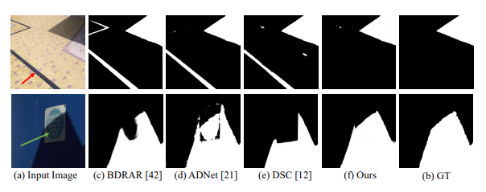
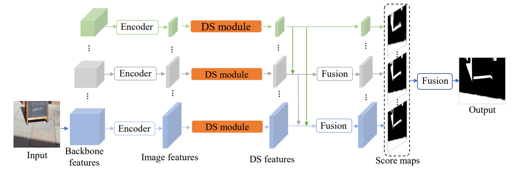
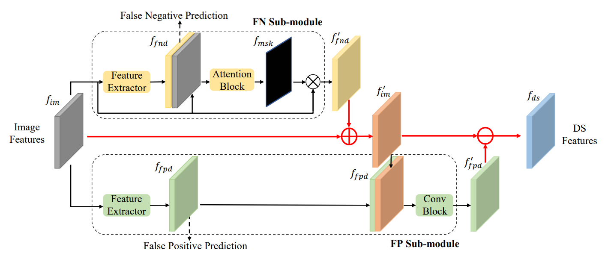

# DSD

PyTorch non-official implementation of ["Distraction-aware Shadow Detection, CVPR'19"](https://openaccess.thecvf.com/content_CVPR_2019/papers/Zheng_Distraction-Aware_Shadow_Detection_CVPR_2019_paper.pdf)

Author's original page: [GitHub](https://quanlzheng.github.io/projects/Distraction-aware-Shadow-Detection.html)

## Approach

This paper is to solve the problem of distraction region (FP and FN). For example:

* region pointed by red arrow **(false positive, FP)**
* region pointed by green arrow **(false negative, FN)**

## Model

We use ResNeXt101 to extract features, the schematic of DSC is showed below

and the DSD model is showed as follow

## Requirements
* PyTorch == 1.8.1 (training and testing)
* Python 3.6
* progressbar2
* scikit-image
* pydensecrf

## Train/Test

**train** `python train.py`
**test** `python test.py`

Pretrained Model. Download the model from [BaiduDisk](https://pan.baidu.com/s/10sbMPlWzpv3ws8IGqo8WGA). **Code: zaai**
ResNeXt101 model (put in resnext folder). [BaiduDisk](https://pan.baidu.com/s/1SoCy7Iw3Pi0wcHdHeH54NA). **Code: oka4**

## Results

We use one GTX 2080Ti to train the DSD on SBU dataset.

**wFb: 85.00, BER: 3.39, pErr: 3.48, nErr: 3.29, acc: 0.9667**

#### SBU Dataset

| Methods | BER | Accuracy |
| --- | --- | --- |
| DSD (paper) | 3.45 | - |
| DSD (Our) | **3.39** | 0.96 |